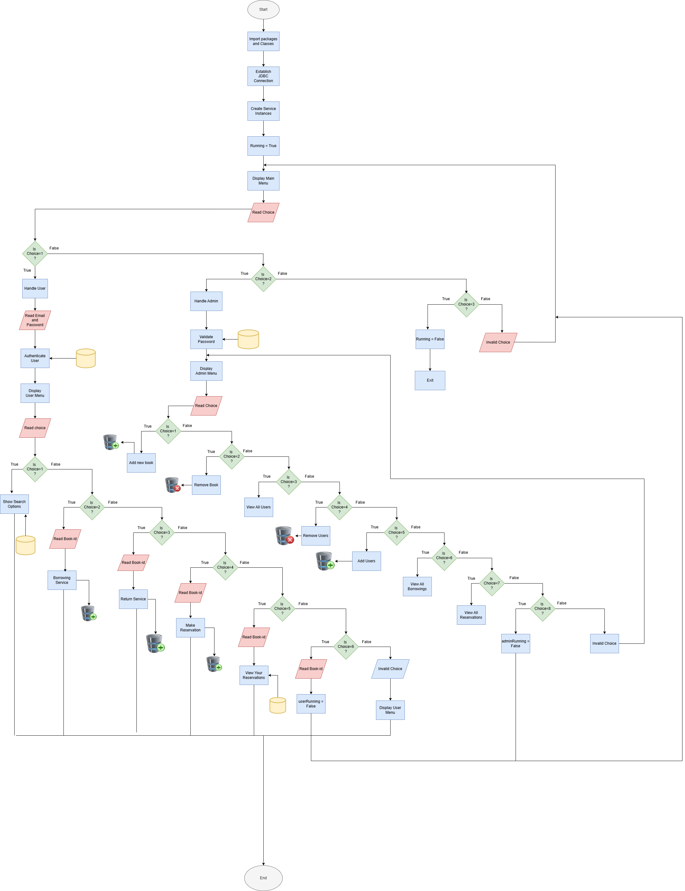
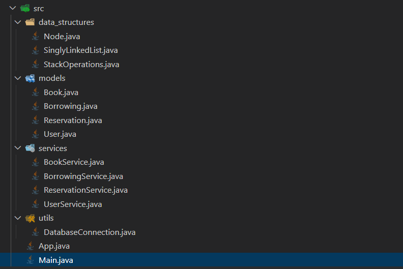

# LIBRARY MANAGEMENT SYSTEM





## About :
This **Library Management System** is a console-based Java application developed during my second semester. It showcases advanced Java concepts including **Object-Oriented Programming (OOP), access modifiers, exception handling, package management,** and **JDBC for database interaction**. The system effectively stores and manages library data, displaying information directly in the console. A **custom data structure**, functioning similarly to a **linked list**, is implemented for **efficient object storage**.

The system is designed for both user and administrative access, each with its own set of operations.

The project is organized into distinct packages, each serving a specific purpose:

-**data_structure**: Contains the core logic for the custom data structure, mimicking a linked list.
-**models**: Houses the classes for various objects (e.g., Book, User), providing getter and setter methods for data access and modification.
-**services**: Implements the business logic for operations on objects, including CRUD (Create, Read, Update, Delete) operations and integration with the custom data structure.
-**utils**: Manages the database connection using JDBC to a MySQL database.
-**main file**: Contains the Main class, serving as the entry point for running the application.

## Installation
1. Clone the repo:
   ```sh
   git clone https://github.com/jainamb12/library-management-system.git
   ```
2. Navigate into the project directory:
   ```sh
   cd src
   ```
3. Install Requirements:
   ```sh
   Java Development Kit (JDK) 11+  
Download from: [Oracle JDK](https://www.oracle.com/java/technologies/javase-downloads.html) or [OpenJDK](https://openjdk.org/)
   ```sh
   8.0.30 / PHP 8.0.30 or higher
   Download from: [PHP Official Website](https://www.php.net/downloads)
   ```

## Usage :
Before compiling the project, make sure you have **xampp control panel** install on your system, and **mysql** database is running. Then follow the below steps:
1) Run Mysql and Apache in your xampp control panel check if the port is 3306 and 80 respectively. If not, change them to 3306 and 80 respectively by editing the **httpd.conf** and **my.ini** files. Then restart the server. If still port is occupied , then change the port in **httpd.conf** and **my.ini** files to any other and update in the code where ever required. Then restart the server.

2) open Mysql php :
   ```sh
   http://localhost/phpmyadmin
   ```
3) create a new database **library_db** and import the **library_db.sql** file from the project directory.

4) open the project and add **mysql-connector-jarFile** to **refrence libraries** section.
5) compile the project using 
    ```sh
    javac Main.java
    ```
6) run the project using
    ```sh
    java Main
    ```

## Contributing
Contributions are welcome! Follow these steps:
1. Fork the project.
2. Create a new branch (`git checkout -b feature-branch`).
3. Commit your changes (`git commit -m 'Add feature'`).
4. Push to the branch (`git push origin feature-branch`).
5. Open a pull request.
